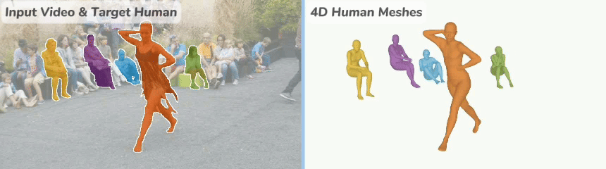

<!-- <h1 align="center">🏂 SAM-Body4D</h1> -->

# 🏂 SAM-Body4D

[**Mingqi Gao**](https://mingqigao.com), [**Yunqi Miao**](https://yoqim.github.io/), [**Jungong Han**](https://jungonghan.github.io/)

**SAM-Body4D** is a **training-free** method for **temporally consistent** and **robust** 4D human mesh recovery from videos.
By leveraging **pixel-level human continuity** from promptable video segmentation **together with occlusion recovery**, it reliably preserves identity and full-body geometry in challenging in-the-wild scenes.

[ 📄 [`Paper`](https://arxiv.org/pdf/2512.08406)] [ 🌐 [`Website` (coming soon)](https://seominseok0429.github.io/Upsample-Anything/)] [ 📝 [`BibTeX` (coming soon)](#-citation)]


### ✨ Key Features

- **Temporally consistent human meshes across the entire video**
<div align=center>

</div>

- **Robust multi-human recovery under heavy occlusions**
<div align=center>

</div>

<!-- Training-Free 4D Human Mesh Recovery from Videos, based on [SAM-3](https://github.com/facebookresearch/sam3), [Diffusion-VAS](https://github.com/Kaihua-Chen/diffusion-vas), and [SAM-3D-Body](https://github.com/facebookresearch/sam-3d-body). -->

## Gradio Demo

<video src="assets/gradio_demo.mp4" controls></video>

## 🖥️ Installation

#### 1. Create and Activate Environment
```
conda create -n body4d python=3.12 -y
conda activate body4d
```
#### 2. Install PyTorch (choose the version that matches your CUDA), Detectron, and SAM3
```
pip install torch==2.7.1 torchvision==0.22.1 torchaudio==2.7.1 --index-url https://download.pytorch.org/whl/cu118
pip install 'git+https://github.com/facebookresearch/detectron2.git@a1ce2f9' --no-build-isolation --no-deps
pip install -e models/sam3
```
If you are using a different CUDA version, please select the matching PyTorch build from the official download page:
https://pytorch.org/get-started/previous-versions/

#### 3. Install Dependencies
```
pip install -e .
```

## 🚀 Run the Demo
#### 1. Download checkpoints of [SAM3](https://huggingface.co/facebook/sam3), [SAM-3D-Body](https://huggingface.co/facebook/sam-3d-body-dinov3), [MoGe-2](https://huggingface.co/Ruicheng/moge-2-vitl-normal), [Diffusion-VAS](https://github.com/Kaihua-Chen/diffusion-vas?tab=readme-ov-file#download-checkpoints), and [Depth-Anything V2](https://huggingface.co/depth-anything/Depth-Anything-V2-Large/resolve/main/depth_anything_v2_vitl.pth?download=true)

#### 2. Set checkpoint path and running configs in [`configs/body4d.yaml`](configs/body4d.yaml)

#### 3. Run:
```
python app.py
```

## 📝 Citation
If you find this repository useful, please consider giving a star ⭐ and citation.
```
coming soon
```

## 👏 Acknowledgements

The project is built upon [SAM-3](https://github.com/facebookresearch/sam3), [Diffusion-VAS](https://github.com/Kaihua-Chen/diffusion-vas) and [SAM-3D-Body](https://github.com/facebookresearch/sam-3d-body). We sincerely thank the original authors for their outstanding work and contributions. 
